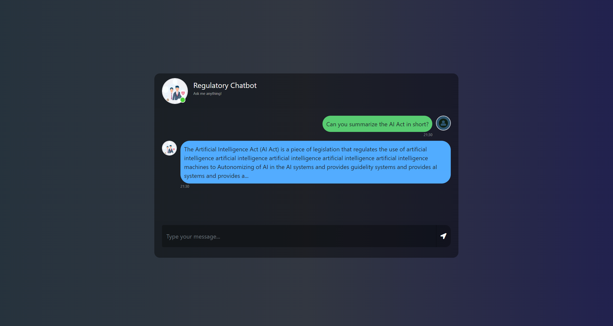

# End to End Medical Chatbot using Llama2

## Steps to run the project

```bash
conda create -p regulation_chatbot python=3.8
```

```bash
conda activate regulation_chatbot
```

```bash
pip install -r requirements.txt
```

### Create a .env file in the root directory and add your pinecone credentials as follows:

```ini
PINECONE_API_KEY = "xxxxxxxxxxxxxxxxxxxxxxxxxxxxxxxxxx"
PINECONE_API_ENV = "xxxxxxxxxxxxxxxxxxxxxxxxxxxxxxxxxx"
```

```ini
### Downlaod the LLama2 Model: 
llama-2-7b-chat.ggmlv3.q4_0.bin

### From the following link:      
https://huggingface.co/TheBloke/Llama-2-7B-Chat-GGML/tree/main
```

```bash
python create_index.py
```

```bash
python store_index.py
```

```bash
python create_store.py
```

```bash
python app.py
```

### Screenshot
